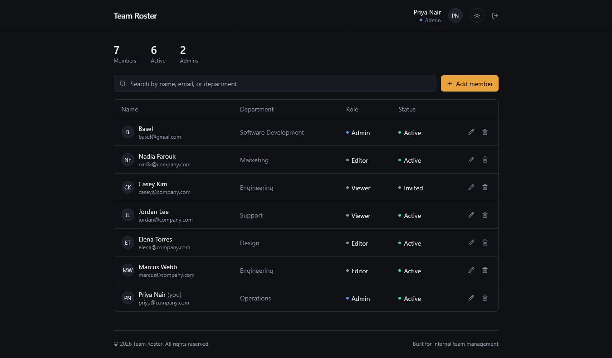

# Team Roster Dashboard

A minimal, professional team directory dashboard with authentication, role-based authorization (Admin / Editor / Viewer), and full CRUD on members — built with **React**, **Vite**, and **Tailwind CSS**.


<!--
📸 Add a screenshot of the app here once you have one:

-->


---

## ✨ Features

- 🔐 **Authentication** — sign in with email/password, or create a new account. Passwords must be at least 6 characters; duplicate emails are rejected.
- 🛡️ **Role-Based Authorization**:
  - **Admin**: add, edit, remove, and reassign anyone's role.
  - **Editor / Viewer**: view the roster and edit only their own name/email. Attempts to change other fields are rejected in application logic (`App.jsx`), not just hidden in the UI.
- 📋 **Full CRUD** — add, edit, and remove team members from a slide-over panel, with per-field required validation and a delete confirmation step.
- 💾 **Persistence** — the roster, credentials, and theme preference are saved to the browser's `localStorage`, so they survive a page refresh.
- 🌗 **Light/Dark Mode** — toggle from the dashboard's top bar.

---

## 🚀 Getting Started

### Prerequisites

- [Node.js](https://nodejs.org/) (v18+ recommended)
- npm

### Install & Run

```bash
npm install
npm run dev
```

Then open the URL Vite prints (usually `http://localhost:5173`).

### Production Build

```bash
npm run build
npm run preview
```

---

## 👤 Demo Accounts

| Role   | Email                | Password  |
| ------ | -------------------- | --------- |
| Admin  | `priya@company.com`  | `demo123` |
| Member | `jordan@company.com` | `demo123` |

You can also create a brand-new account from the "Create an account" link on the sign-in screen — pick any role (Admin, Editor, or Viewer) when signing up.

---

## 📁 Project Structure

```
team-roster-dashboard/
├── index.html              # Vite HTML entry point
├── package.json
├── vite.config.js
├── tailwind.config.js
├── postcss.config.js
└── src/
    ├── main.jsx             # React root, mounts <App />
    ├── index.css            # Tailwind directives
    ├── App.jsx              # Main app: auth, authorization, CRUD, theme
    ├── components/
    │   ├── Dot.jsx           # Small colored status dot
    │   ├── FieldWrap.jsx     # Red-border + exclamation wrapper for invalid fields
    │   └── ToastCard.jsx     # Toast notification (success/error)
    └── lib/
        ├── theme.js          # Light/dark color palettes
        ├── constants.js      # Roles, seed data, storage keys, small helpers
        └── storage.js        # localStorage-backed persistence layer
```

---

## ⚙️ How It Works

- **Authentication** — sign in with email/password against stored credentials, or create a new account.
- **Authorization** — enforced in application logic in `App.jsx`, not just hidden in the UI, so restricted actions can't be triggered by tampering with the interface.
- **CRUD** — add, edit, and remove members via a unified slide-over panel with field validation.
- **Persistence** — handled by `src/lib/storage.js`, which mirrors a `window.storage`-style API on top of real `localStorage`.
- **Theme** — all colors are defined centrally in `src/lib/theme.js`.

---

## 🛠️ Tech Stack

- [React](https://react.dev/)
- [Vite](https://vitejs.dev/)
- [Tailwind CSS](https://tailwindcss.com/)

---

## 🤝 Contributing

Contributions are welcome! To contribute:

1. Fork the project
2. Create your feature branch (`git checkout -b feature/amazing-feature`)
3. Commit your changes (`git commit -m 'Add some amazing feature'`)
4. Push to the branch (`git push origin feature/amazing-feature`)
5. Open a Pull Request

---

## 📄 License

This project is licensed under the [MIT License](LICENSE).
